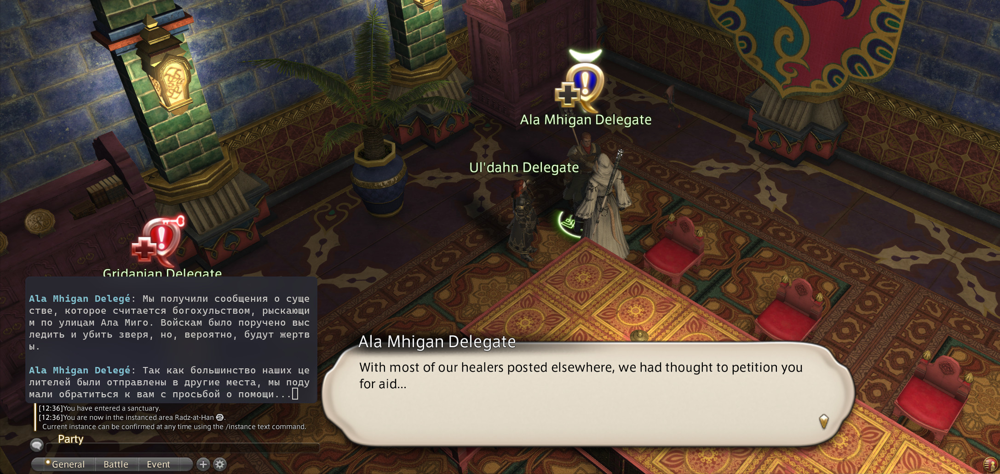

# FF14 Tataru-helper-cli for LINUX

This is linux analog of [NightlyRevenger/TataruHelper](https://github.com/NightlyRevenger/TataruHelper) for Final Fantasy 14.

## How it works
Process: Xorg screenshot -> openCV -> ggl translate -> terminal text.

## Requirements
Install:

- for screenshot: X11, Xext

- for preprocessing img: opencv4

- for OCR: tesseract with installed lang libraries (from and to)

- for get-request to translate: cpr (curl wrapper)

- for loading yaml-config: yaml-cpp

1. Check requirements and compile binary (with `make`)
2. Check settings in CONFIG.yml (it is preconfigured for 2560x1440 display for russian lang)

## Usage

Run ./bin/tataru with path to your .yaml config:
`/home/user/tataru-ocr/bin/tataru "/home/user/tataru-ocr/CONFIG.yaml"`
